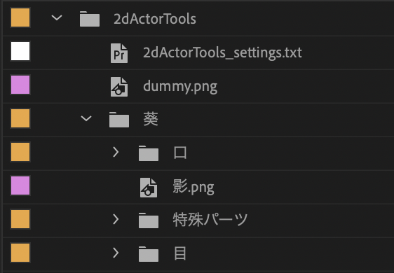
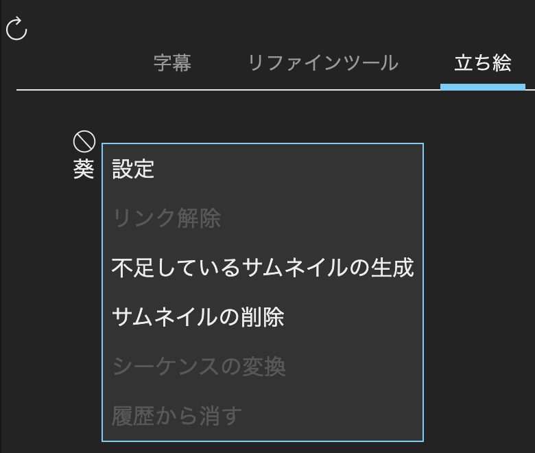
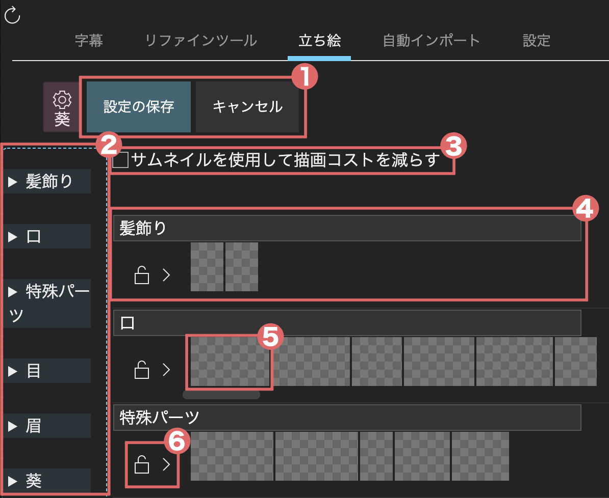
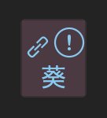
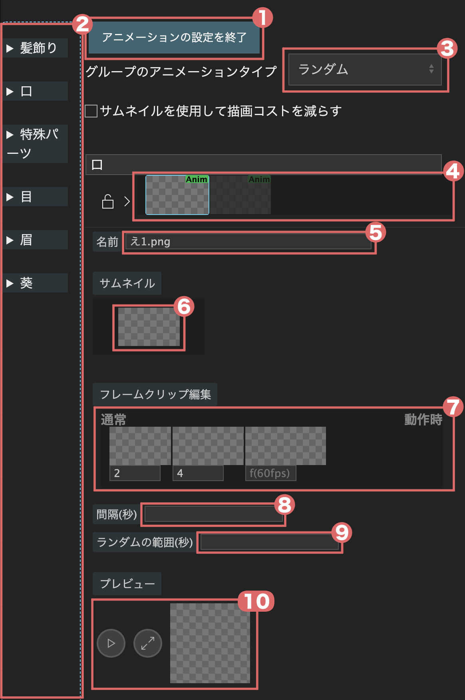
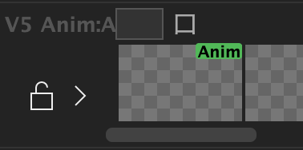

# 立ち絵

今のところ、このツールではパーツごとに別れたPNGファイルのみ対応しています。PSDしかない立ち絵は画像編集ソフトや[PSDTool](https://oov.github.io/psdtool/){.new_tab}などを利用してPNGファイルを作成してください。

(actor-setting-general)=
## 共通設定
1. `2dActorTools`というビンの下に立ち絵のフォルダをインポートします。  
{.half-width}
2. パネルの左上にある更新ボタンを押します。その後もう一度立ち絵タブを開くとキャラクター名が表示されているので、右クリックして`設定`を選びます。  
{.half-width}
3. 構成ファイルの保存先は可能であれば立ち絵のフォルダのトップにしてください。その後もう一度、サムネイルの保存先を尋ねられるので、立ち絵のフォルダ以外を指定してください。
4. 立ち絵の設定画面が表示されます。初期設定ではフォルダ名がグループ名となり、そのフォルダの下に含まれる画像が並べられています。

### 設定画面の説明
{.half-width}
#### ①　保存/キャンセルボタン
設定の編集内容を保存する場合は`設定の保存`ボタンをクリックしてください。キャンセルボタンを押すと編集内容が失われます。
#### ②　パレット
クリップを追加するにはここからドラッグしてください。
#### ③　サムネイルを使用して描画コストを減らす
立ち絵の軽量化機能のON/OFFを切り替えます。詳細は[立ち絵の軽量化](#actor-lightweight)をご覧ください。
#### ④ グループ
ドラッグで順番を入れ替えられます。クリップ以外の部分を右クリックして追加/削除ができます。上にあるグループほど前面に表示されます
#### ⑤ クリップ
パーツのサムネイルが表示されています。ドラッグで順番を入れ替えられます。右クリックから削除を選択、もしくは選択した状態で[{kbd}`Delete`]{.win-deco}[{kbd}`Delete`]{.mac-deco}を押すと削除できます。
#### ⑥　錠アイコン
設定では使用しません。

### どのように設定にすればいいの？
動画編集時はグループ内のクリップを切り替えることで立ち絵の編集を行います。なので、一つのグループには同じ部位のパーツを並べてください。グループ内では、よく使うパーツを近くにまとめておくと編集の効率が上がります。

### 共通設定の注意点
グループの（入れ替え/追加/削除）を行なった場合、編集済みの立ち絵を再度編集しようとすると表示が崩れることがあります。グループの変更は動画編集を終えた時点で行うことを推奨します。グループ内でクリップの（入れ替え/追加/削除）は、どのタイミングで行っても問題ありません。

(actor-usage-general)=
## 使い方
### キャラクターシーケンスの作成
1. シーケンスパネルでクリップを未選択の状態にします。
2. エクステンションパネルのキャラクター名を左クリックします。  
{.icon-img}
3. `クリップが選択されていません。シーケンスを作成しますか？`というダイアログが出るので`OK`を押します。
4. シーケンス名を入力し、`OK`を押します。
5. プロジェクトパネルにキャラクターシーケンスが追加されるので、ドラッグ&ドロップで編集しているシーケンスに追加します。
6. キャラクターシーケンスとリンクした音声トラックがある場合、消去します。[{kbd}`Alt`]{.win-deco}[{kbd}`option⌥`]{.mac-deco}を押しながら音声トラックをクリックして選択し、[{kbd}`Delete`]{.win-deco}[{kbd}`Delete`]{.mac-deco}を押して消去してください。

### 編集
1. キャラクターシーケンスのみを選択した状態でエクステンションパネルのキャラクター名を左クリックします。
2. アイコンが鎖マークに変わり立ち絵シーケンスとリンクします。  
{.icon-img}
3. サムネイルをクリックすると、現在の再生ヘッドの位置から先のクリップが変更されます。

## アニメーションの設定
```{tip}
先に[共通設定](#actor-setting-general)をご覧ください。
```
設定画面で、アニメーションさせたいグループのクリップ以外のところを右クリックして、アニメーションの設定を選びます。
### 設定画面の説明
{.half-width}
#### ① アニメーションの設定を終了
アニメーションの設定を保存するにはこのボタンを押してください。
#### ② パレット
クリップを追加するにはここからドラッグしてください。
#### ③ アニメーションタイプの選択
グループのアニメーションタイプを選択します。ランダムは瞬き、リップシンクは口パクに適しています。
#### ④ アニメーションクリップ一覧
グループのアニメーションクリップ一覧です。アニメーションクリップを追加するにはパレットからドラック＆ドロップしてください。右クリックから削除を選択、もしくは選択した状態で[{kbd}`Delete`]{.win-deco}[{kbd}`Delete`]{.mac-deco}を押すと削除できます。
#### ⑤ アニメーションクリップの名前
アニメーションクリップの名前を変更できます。
#### ⑥ アニメーションクリップのサムネイル
アニメーションクリップのサムネイルを変更できます。パレットからドラッグ＆ドロップしてください。
#### ⑦ フレームクリップ一覧
アニメーションに使用するクリップを指定します。パレットからアニメーションに使用するクリップをドラッグ＆ドロップしてください。右クリックから削除を選択、もしくは選択した状態で[{kbd}`Delete`]{.win-deco}[{kbd}`Delete`]{.mac-deco}を押すと削除できます。クリップの下にあるテキストボックスは表示したいフレーム数を入力します。
#### ⑧ アニメーション実行間隔（ランダムのみ）
アニメーションを実行する間隔を指定します。
#### ⑨ ランダムの範囲（ランダムのみ）
`⑧アニメーション実行間隔`で指定した間隔から、ここで指定した秒数の範囲でランダムにずらしてアニメーションを実行します。
#### ⑩ アニメーションのプレビュー
再生ボタンを押すとアニメーションのプレビューが見れます。右側のボタンを押すと表示位置をリセットします。

### どのように設定にすればいいの？
1. 適当なクリップを`②パレット`から`④アニメーションクリップ一覧`にドラッグ&ドロップします。ここでドロップしたクリップは名前とサムネイルの初期設定に使用されます。
2. `⑤名前`と`⑥サムネイル`はお好みで変更してください。
3. アニメーションに使用したいクリップを`②パレット`から`⑦フレームクリップ一覧`にドラッグ&ドロップします。一番左が通常時です。例えば、目のアニメーションであれば開いた状態、口のアニメーションであれば閉じた状態のクリップを一番左に持ってきてください。
4. `⑦フレームクリップ一覧`に並べたクリップの下にあるテキストボックスに表示したいフレーム数を60fpsをベースとして入力します。30fpsで動画を作る場合は2の倍数を入力してください。
5. (アニメーションタイプがランダムの場合)間隔とランダムの範囲を秒で入力してください。
6. 設定が終了したら上にある`アニメーションの設定を終了`ボタンを押してください。
7. アニメーションクリップはグループ内の一番右に追加されています。お好きな位置に移動させてください。

### アニメーション設定の注意点
アニメーションタイプは1グループにつき1つだけ指定できます。別のアニメーションタイプを選択したい場合はグループを追加してください。

### アニメーションの細かい仕様
`⑦フレームクリップ一覧`で指定した表示フレーム数は目安で、実際に表示されるフレーム数はここで指定したものより短くなる可能性があります。

## アニメーションの使い方
```{tip}
先に通常編集での[使い方](#actor-usage-general)をご覧ください。
```
{.half-width}
1. アニメーションタイプを口パクにした場合、グループの左上に`Anim:A`という表示が現れます。右側のテキストボックスには口パクの元になる音声クリップのあるトラック番号を指定します。
2. 普通のクリップと同様にサムネイルをクリックして編集します。その際プレビューとして、アニメーションタイプが口パクであれば１音声クリップ分、ランダムであれば1回だけアニメーションのキーフレームを作成します。
3. 立ち絵の編集が全て終了したら、アニメーションのあるグループを右クリックして`アニメーションのベイク`を選択してください。全てのキーフレームを作成します。

## その他機能
(actor-lightweight)=
### 立ち絵の軽量化
サムネイルを使用して立ち絵を軽量化します。軽量になる仕組みは[動画](https://www.nicovideo.jp/watch/sm39643197?from=40)をご覧ください。  
設定画面で`③サムネイルを使用して描画コストを減らす`にチェックを入れて保存するとインポートされている立ち絵画像のメディアリンクをサムネイルの画像に切り替えます。その際、既存の立ち絵シーケンスのパーツの位置がズレることがあります。これを修正するには、ズレてしまった立ち絵シーケンスとリンクした状態で立ち絵タブのキャラクター名を右クリックし、`シーケンスの変換`を選択してください。  

### 左のアイコン
{.icon-img} をクリックすると範囲設定のアイコンが現れます。
| アイコン | 説明 |
| :-: | :- |
| {.icon-img} | グループのサムネイルを非表示にします。 |
| {.icon-img} | 範囲設定のアイコンを隠します。 |
| {.icon-img} | 配置されるクリップが次のクリップの最初までになります。 |
| {.icon-img} | 配置されるクリップが次のクリップの最後までになります。 |
| {.icon-img} | 配置されるクリップがアクティブなシーケンスのマーカーの位置までになります。 |

後ろ3つのアイコンはONにするとパーツを変更した時の挙動が変わります。複数のアイコンをONにしている時は一番短いところまでになります。

### クリップセット
[{kbd}`Delete`]{.win-deco}[{kbd}`Delete`]{.mac-deco}を押しながらキーボードの`A~Z0~9`のキーを押すと、現在表示されている全てのグループのクリップを記録します。上部に表示されたキーのボタンをクリックすると、全てのグループが記録したものに変更されます。クリップセットを削除するには設定画面で削除したいキーのボタンを右クリックし、`削除`を選んでください。

(actor-edit-arrow)=
### 方向キー
方向キーと[設定の追加割り当て](#additional-assignments)で指定したキーを押すと、編集対象のキャラクターの切り替え（左右キー）と編集点の移動（上下キー）ができます。
```{warning}
MacOS版はエクステンションで左右キーを取得する方法が不明のため、[設定の追加割り当て](#additional-assignments)で別のキーを割り当ててご使用ください。
```