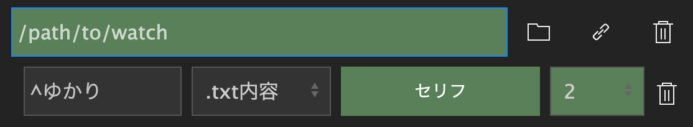
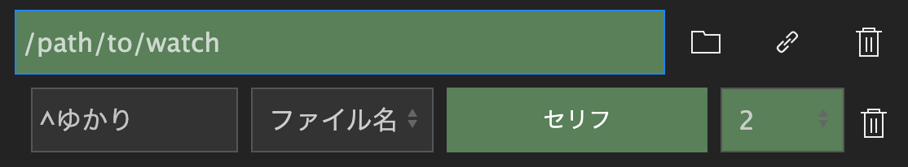

# 自動インポート

音声合成ソフトが出力した音声ファイルを自動でプロジェクトにインポートし、シーケンスに配置します。
対応形式は`wav`、`mp3`、`wma`です。

## 使い方
1. `監視フォルダの追加`ボタンを押し、監視フォルダ設定を追加します。
2. テキストボックスに監視するフォルダのパスを入力します。右にあるフォルダアイコンをクリックすると、フォルダを選択するダイアログを表示できます。
3. `ルール追加`ボタンを押し、ルールを追加します。1キャラクターにつき1ルールをおすすめします。
4. マッチング対象を`.txt内容`か`ファイル名`から選びます。`.txt内容`はテキストファイルの内容とマッチングし、`ファイル名`は音声ファイルのファイル名とマッチングします。
5. `マッチングパターン`にキャラクター名など、出力されるファイル名/テキストに含まれる文字列を指定します。正規表現が使用できます。  
    例えば、次のようなテキストファイルが音声データと同時に出力される場合、マッチング対象を`.txt内容`、`マッチングパターン`に`^ゆかり`と入力します。  
    ```{code-block}
    ---
    caption: voice-1.txt
    ---
    ゆかり＞こんにちは
    ```    
    {.half-width}  
    
    次のようにテキストファイルのファイル名にキャラクター名が含まれる場合は、マッチング対象を`ファイル名`、`マッチングパターン`に`^ゆかり`と入力します。  
    ```{code-block}
    ---
    caption: ゆかり_こんにち….txt
    ---
    こんにちは
    ```
    {.half-width}  

    次のようなファイルが出力される場合でもマッチング対象を`.txt内容`、`マッチングパターン`を`^.*ゆかり.*＞`のように設定すると、どちらも同じルールにマッチングします。  
    ```{code-block}
    ---
    caption: voice-1.txt
    ---
    結月ゆかり_喜び＞吾輩は猫である
    ```
    ```{code-block}
    ---
    caption: voice-2.txt
    ---
    ゆかり(雫)_悲しみ＞名前はまだ無い
    ```

    ```{tip}
    `^`は行頭を表す正規表現です。他キャラクターへの呼びかけにマッチングさせないために入れています。
    ```

6. プロジェクトパネルで音声のインポート先のビンを選択し、`選択中のビンをセット`ボタンを押します。
7. `Track`セレクトボックスでインポート後に音声クリップを配置するトラック番号を設定します。音声クリップは現在開かれているシーケンスの再生ヘッドを先頭に配置されます。
8. 鎖アイコンをクリックしてフォルダの監視を開始します。正常に監視が開始されると薄暗くなり、設定を変更できないようになります。設定内容に誤りがある場合は赤く表示されるので修正してください。もう一度鎖アイコンをクリックすると監視を停止します。

### 監視フォルダ、ルールの削除
ゴミ箱アイコンをクリックしてください。