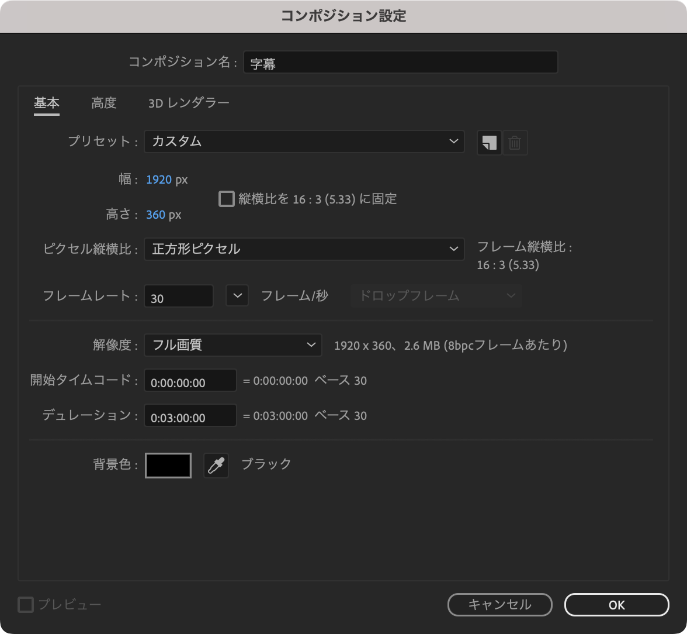
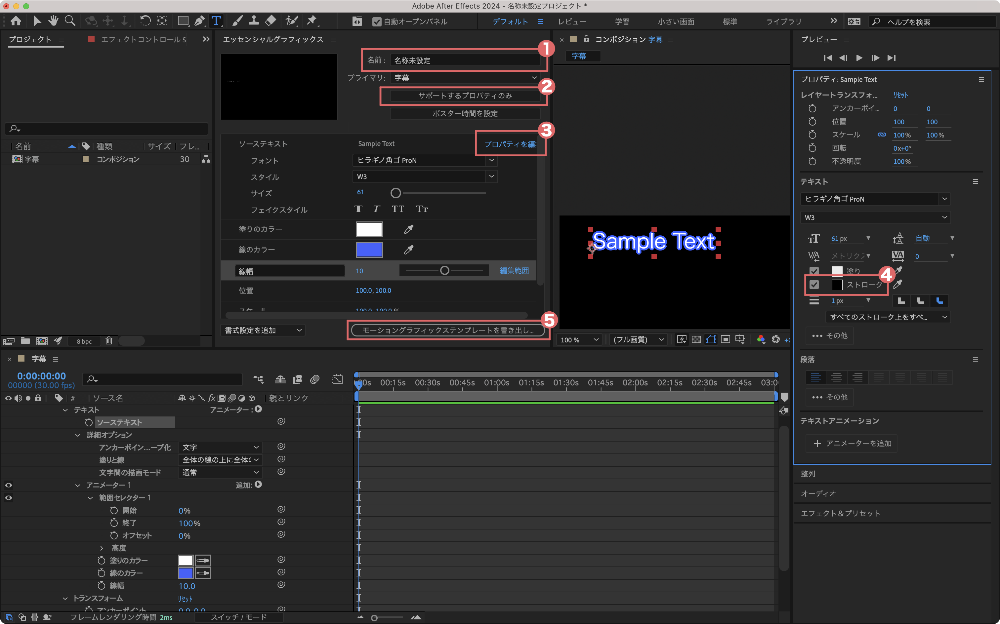
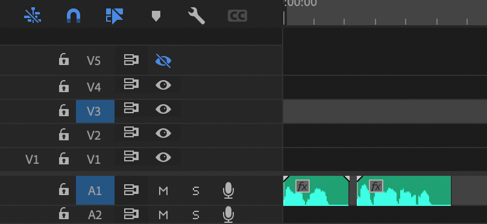
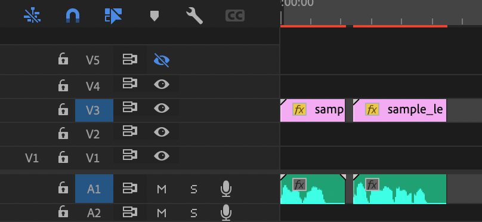
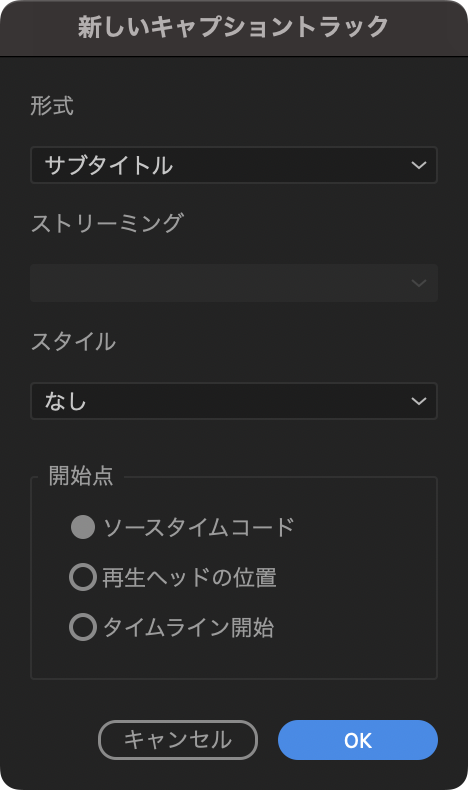

# 字幕

**字幕配置機能を利用するには、音声ファイルと同じフォルダに、発話内容を記録した音声ファイルと同名のテキストファイルを出力する必要があります。**
テキストファイルの出力方法は、お使いの音声合成ソフトのマニュアルをご覧ください。

配置する字幕には[MOGRT](#mogrt)、[SRT](#srt)、[PSD](#psd)の3つの種類があります。
- [MOGRT](#mogrt)（おすすめ）  
アニメーションさせることも可能で、一番表現力が高いです。
- [SRT](#srt)  
PremierePro 23.1以降であればエッセンシャルグラフィックスに変換可能で、Webなどで公開されているテンプレートを使用できます。
- [PSD](#psd)  
Photoshopを使用し、画像ファイルとして字幕を作成します。他と比べて後から内容を変更するのが面倒という点があります。

```{tip}
このエクステンションでは、字幕の配置は音声クリップの配置と同時ではなく、すでに配置された音声クリップに対して一度の操作で全ての字幕を配置します。
```

(mogrt)=
## MOGRT
AfterEffectsで作るMOGRT(モーショングラフィックステンプレート)ファイルを使用します。
```{caution}
PremiereProでもモーショングラフィックステンプレートを作成できますが、これは使用できません。同じ名前ですが中身は別物です。
```
AfterEffectsを持っていない方や、とりあえず試したい方は[サンプルのMGTファイル](#mogrt-sample)を使用してください。

### MOGRTを作成する
字幕を自作する方法です。
1. AfterEffectsを開き、新規コンポジションを作成します。以下の設定項目を適宜変更してください。

    | 項目 | 変更内容 |
    | :-: | :- |
    | 幅と高さ | 字幕の表示範囲になります。作成する動画に合わせて変更してください。 |
    | フレームレート | 字幕にアニメーションをつける場合は作成する動画に合わせて変更してください。 |
    | デュレーション | 短いと音声クリップの終了前に字幕が消えることがあります。十分な長さにしてください。（サンプルのMOGRTは3分にしてあります。） |

    {.half-width}

2. コンポジションにテキストを追加します。
3. ツールバーから`ウィンドウ` > `エッセンシャルグラフィックス`を選びます。
4. エッセンシャルグラフィックスのパネルに`ソーステキスト`や`位置`など、PremierePro上で操作したいプロパティをドラッグ＆ドロップします。
    
    #### ① 名前
    適当なものに変えてください。
    #### ② サポートするプロパティのみ
    このボタンを押すとエッセンシャルグラフィックスに使用できるプロパティのみ開かれた状態になります。
    #### ③ プロパティを編集
    ソーステキストのプロパティを追加できます。フォントなどを変更できるようになるため全て選択することをお勧めします。
    #### ④ ストローク
    文字の縁取りが現れない時はここにチェックを入れてください。
    #### ⑤ モーショングラフィックステンプレートを書き出し
    MOGRTを保存するボタンです。

5. その他の装飾などを終えたら`⑤モーショングラフィックステンプレートを書き出し`ボタンを押します。
6. 保存先をローカルドライブにし、参照ボタンからフォルダを選択して、`OK`を押して保存してください。

```{tip}
MOGRTファイルはAfterEffectsの ツールバー > ファイル > プロジェクトを開く から開くことができます。
```

### 使い方
1. エクステンションの字幕タブの一番上にある`MOGRTのインポート`ボタンを押し、MOGRTファイルをインポートします。MOGRTファイルは`モーショングラフィックステンプレートメディア`というビンにインポートされます。
```{caution}
必ず`モーショングラフィックステンプレートメディア`という名前のビンにインポートする必要があります。違うビンにインポートされた場合、プロジェクトのトップに`モーショングラフィックステンプレートメディア`という名前のビンを作成し、MOGRTファイルを移動させてください。
```

2. `トラックに並べるMOGRTを選択`のセレクトボックスから配置したいMOGRTを選択します。（他の設定は[こちら](#subtitle-settings)をご確認ください）
3. 字幕の元になる音声トラックと字幕を並べたいビデオトラックのみをターゲットトラックにします。  
  {.half-width}
4. `ターゲットトラックにMOGRTを並べる`ボタンを押すとビデオトラックに字幕が並びます。  
  {.half-width}

### 複数の字幕のプロパティを一気に変更するには
リファインツールの[プロパティコピー](#property-copy)を使用してください。

### MOGRTのインポートについて
一度インポートしたMOGRTは記録され、別のプロジェクトで使用する時に自動でインポートされます。
### MOGRTの履歴の消し方
`トラックに並べるMOGRTを選択`からは以下の方法で消せます。
1. 消したいMOGRTをプロジェクトから取り除く
2. エクステンションパネル左上の`更新アイコン`をクリックします。
3. 消したいMOGRTをセレクトボックスで選択すると、セレクトボックスの右に`ゴミ箱アイコン`が表示されるのでクリックします。

(mogrt-sample)=
### サンプルのMGTファイル
[GithubのRelease](https://github.com/wabimochi/2dActorTools/releases/tag/v1.0){.new_tab}から[Sample_MGT.zip](https://github.com/wabimochi/2dActorTools/releases/download/v1.0/Sample_MGT.zip)または[Sample_MGT_360.zip](https://github.com/wabimochi/2dActorTools/releases/download/v1.0/Sample_MGT_360.zip)をダウンロードしてください。left, center, rightの３種類のmogrtが含まれており、それぞれ左寄せ、中央寄せ、右寄せになっています。

| | Sample_MGT | Sample_MGT_360 |
| - | - | - |
| サイズ | 1920x1080 | 1920x360 |
| 線の結合 | マイター | ラウンド |

{.half-width}

```{tip}
サイズが小さい方が編集やエンコードが早くなります。ただしフォントサイズやテキスト量によっては見切れる場合があるので、目視チェックをお勧めします。
```

#### サンプルのMOGRTで変更可能なプロパティ一覧
- フォント
- フォントスタイル(italic, boldなど)
- フォントサイズ
- 塗りのカラー
- 線のカラー
- 線幅
- 字間（トラッキングの量）
- 位置
- アンカーポイント

### ソース：テキストエリアについて
テキストファイルではなく、テキストエリアから字幕を生成します。改行毎に1クリップとなります。設定は`ソース：Audioと同じフォルダにあるtxtファイル`と共有してます。

(srt)=
## SRT
SRTファイルとして出力します。SRTの字幕（キャプション）はPremierePro 23.1以降であればエッセンシャルグラフィックスに変換可能で、Webなどで配布されているテンプレートを使用することができます。

### 使い方
1. 字幕の元になる音声トラックをターゲットトラックにします。  
  {.half-width}
2. 保存先を入力し、`保存`ボタンを押します。
3. 出力された.srtファイルをプロジェクトにインポートします。（`保存後に選択中のビンにインポートする`にチェックを入れていると自動でインポートします。）
4. .srtをシーケンスにドラッグ＆ドロップします。
5. 形式をサブタイトル、開始点をソースタイムコードにします。  
  {.restrict-height}
6. トラックの一番上にキャプション用のトラックが現れ、プログラムパネルの下部に字幕が表示されているはずです。
7. 字幕の見た目を変更したい場合、エッセンシャルグラフィックスに変換する必要があります。字幕のクリップを全て選択し、ツールバーの`グラフィックとタイトル` > `キャプションをグラフィックにアップグレード`を選択します。
8. ツールバーの`ウィンドウ` > `エッセンシャルグラフィックス`を選択し、エッセンシャルグラフィックスとして見た目を編集します。

(psd)=
## PSD
「Premiere Photoshop 字幕」などで検索してもらうと詳しい方法が出てくると思います。この方法を使用したい方がいればドキュメントを更新するので、サポートにご連絡ください。

(subtitle-settings)=
## 設定
### プリセットタグ
`話者名＞こんにちは`というテキストデータのとき、プリセットタグに`＞`を指定していると、字幕テキストには`こんにちは`のみ入力されます。（Replaceの簡易版と思ってください）

### Replace（正規表現）
テキストデータを正規表現で置換し、字幕クリップに入力します。
#### 例：句読点を消す
| マッチングパターン | フラグ | Replace後 |
| - | - | - |
| [、。] | g | |
```{code-block}
---
caption: 元の文章
---
いろいろ注文が多くてうるさかったでしょう。お気の毒でした。
もうこれだけです。どうかからだ中に、壺の中の塩をたくさん
よくもみ込んでください。
```
```{code-block}
---
caption: Replace後の文章
---
いろいろ注文が多くてうるさかったでしょうお気の毒でした
もうこれだけですどうかからだ中に壺の中の塩をたくさん
よくもみ込んでください
```