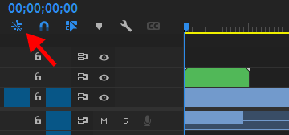

# トラブルシューティング

## 動作から原因を特定する
### [キャラクターシーケンスをシーケンスに配置しようとすると中身が配置される]{.troubleshooting-issues}
### [キャラクターシーケンスが配置できない]{.troubleshooting-issues}
### [シーケンスを配置すると緑色ではなくピンク色のクリップが配置される]{.troubleshooting-issues}
左上のアイコンをONにして、再度シーケンスを配置してみてください。  
{.half-width}

### [設定が保存されない]{.troubleshooting-issues}
設定を変更した直後に更新ボタンを押したり、PremiereProを閉じたりすると設定が保存されない場合があります。設定を変更した後は数秒待ってからエクステンションを閉じるようにしてください。

### [自動インポートが動かない]{.troubleshooting-issues}
### [配置した字幕が文字化けする]{.troubleshooting-issues}
音声合成ソフトから出力されたテキストファイルの文字コードが設定と一致していない可能性があります。エクステンションの設定タブ > テキストファイルの文字コードを`AUTO`や適切な文字コードに変更してください。

### [字幕のクリップがしましまになり、字幕が表示されない]{.troubleshooting-issues}
MOGRTの字幕を使用している場合に発生します。原因はMOGRTのデュレーションが不足しているためです。AfterEffectsを使用し、MOGRTの修正を行なってください。

### [インポートした字幕が一覧に表示されない]{.troubleshooting-issues}
MOGRTが`モーショングラフィックステンプレートメディア`というビンにインポートされていない可能性があります。お手数ですが手動で移動させて、エクステンション左上の更新ボタンを押してください。

### [clip not foundと表示される]{.troubleshooting-issues}
ビンやクリップの名前を変更した可能性があります。名前を戻すか、立ち絵設定から変更後のクリップを登録しなおしてください。

### [サムネイルが？マークになる]{.troubleshooting-issues}
サムネイル画像を移動したり消したりした可能性があります。 立ち絵設定で設定開始してそのまま保存すると、再度サムネイルの保存先を尋ねられるので、もう一度生成してください。

### [立ち絵の表示タイミングがおかしい]{.troubleshooting-issues}
Premiereのバージョンによってクリップのフレームがズレることがあります。バージョンや再現手順をサポートアカウントかGithubのIssueの方にお願いします。

## エラーメッセージから原因を特定する
### [appLocが`ja_JP`以外になっている]{.troubleshooting-issues}
今のところこのエクステンションは日本語専用です。PremiereProを日本語にしてご利用ください。

## 解決しない時は
サポートアカウント([https://twitter.com/2dActor](https://twitter.com/2dActor))までご連絡ください。その際、エラーメッセージや各種アプリケーションのバージョンを併記いただくと解決がスムーズになります。